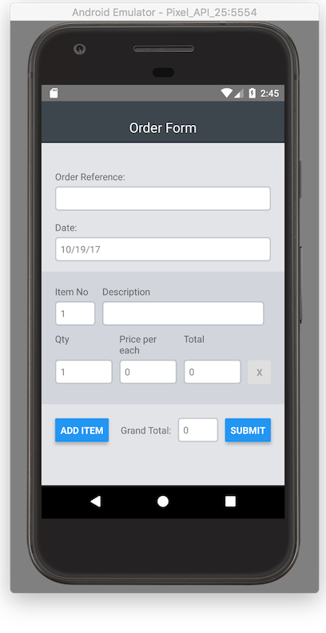
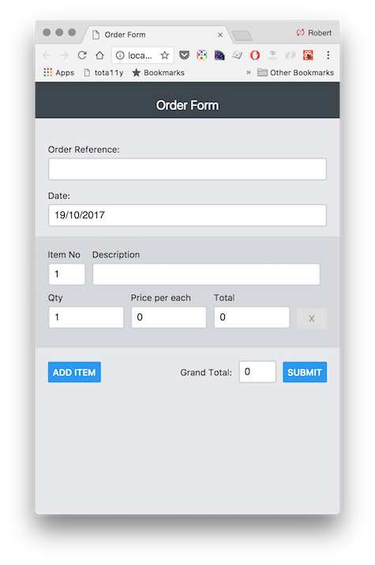
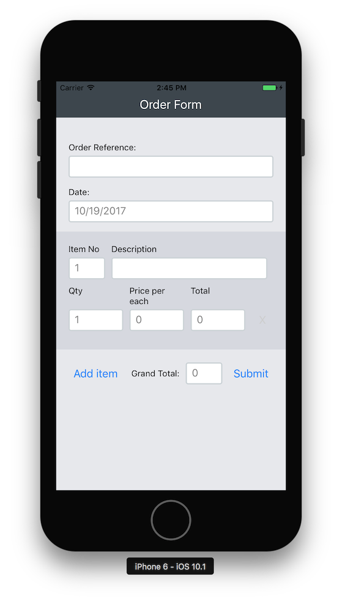

# OrderForm React Native Web Demo :globe_with_meridians: :iphone: :computer:

TODO:
- [ ] Replace `<Button>` with `<TouchableOpacity>` for better cross platform styling
- [ ] Add accessibilty props to Form
- [ ] Add an async action to better simulate a form submission

## Run the project on a specific platform:

#### Android
`react-native run-android`

#### iOS
`react-native run-ios`

#### Web
`npm/yarn run web`

## Testing
`yarn/npm test`